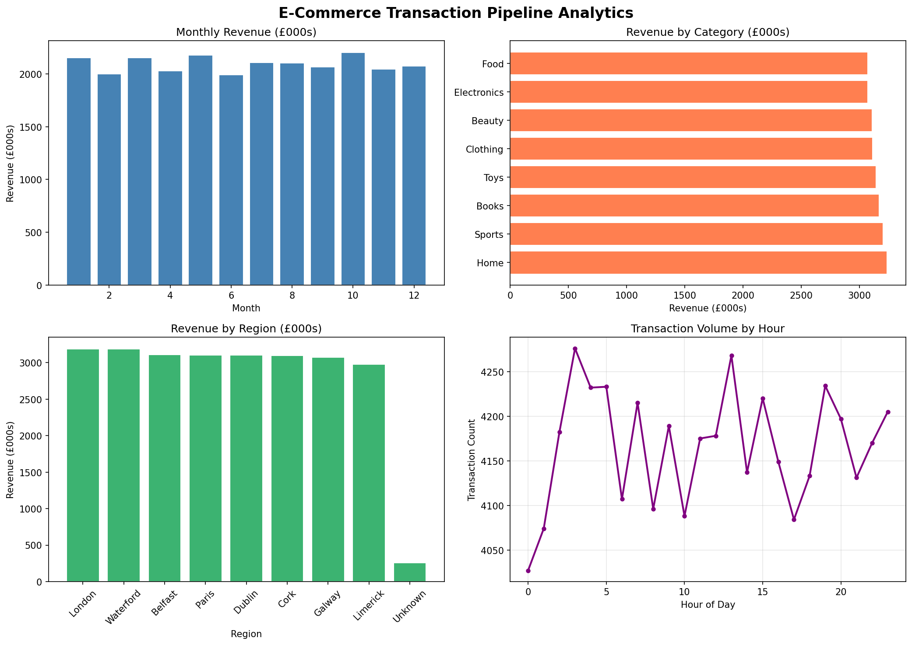

# Large-Scale Data Pipeline

An end-to-end data engineering pipeline processing 100,000 e-commerce 
transactions through ingestion, validation, transformation, aggregation, 
warehouse loading, and analytical reporting.

## Pipeline Architecture
Raw Data → Ingestion → Quality Validation → Transformation → Aggregation → Data Warehouse → Analytical Queries → Visualisation

## Pipeline Stages

1. **Ingestion** — Load 100,000 transaction records (37.9 MB)
2. **Data Quality Validation** — Null detection, duplicate checks, anomaly identification, quality scoring
3. **Transformation** — Null handling, feature engineering, business logic (high-value flags, weekend patterns, time-of-day)
4. **Aggregation** — Spark-style groupBy operations across monthly, category, regional, payment, and hourly dimensions
5. **Warehouse Loading** — SQLite data warehouse with 6 analytical tables
6. **Analytical Queries** — SQL queries for business insights
7. **Visualisation** — Analytics dashboard with 4 charts

## Results

- **100,000 records** processed across full pipeline
- **£25.1M total revenue** processed
- **99.0% data quality score** after validation
- **6 warehouse tables** loaded for downstream analytics
- **Key insight:** Clothing has highest return rate (8.8%), October is peak revenue month

## Analytics Output



## Tech Stack

- Python 3
- pandas (data processing and transformation)
- SQLAlchemy (data warehouse — SQLite)
- Faker (realistic data generation)
- matplotlib (visualisation)

## How to Run

```bash
git clone https://github.com/nithinss16/data-pipeline.git
cd data-pipeline
pip install -r requirements.txt
python3 generate_data.py
python3 pipeline.py
```

## What This Demonstrates

- ETL/ELT pipeline design and implementation
- Data quality validation and scoring
- Feature engineering and business logic
- Aggregation at scale (Spark-style operations)
- Data warehouse loading and SQL analytics
- Production pipeline patterns (logging, stage separation, reporting)